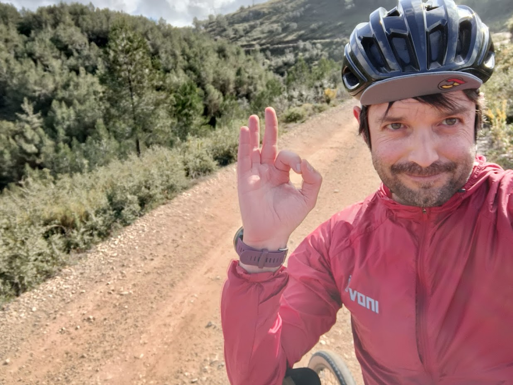

{.profile-pic}

# 👋 Hi, I'm Eugeni!

::: {.lead}

I'm a mobility researcher with a background in environmental management, transport planning, data analytics, and law. I'm passionate about cycling, data visualisation, and maps, which shape my research on how people move and how the built environment influences travel choices.

I hold a PhD in Data Analytics and Society from the [University of Leeds](https://www.leeds.ac.uk/), where I researched cycling and socioeconomic disadvantage. I later worked there as a postdoctoral researcher in active travel and data science at the [Institute for Transport Studies](https://environment.leeds.ac.uk/transport).

Now, I'm based at the [Universitat Autònoma de Barcelona](https://www.uab.cat/), working with [GEMOTT](https://gemott-uab.cat/en/) (the Research Group on Mobility, Transport and Territory), mainly on the [ATRAPA](https://webs.uab.cat/atrapa/) project, which explores public acceptability of sustainable active-travel urban interventions. I'm also involved in research on active commuting to school and big data mobility projects.

This website brings together my research, publications, interactive resources, and field observations. I hope you find something of interest. If you'd like to get in touch, you can reach me at **eugenividal [at] hotmail [dot] com**.

:::
::: {.social-container}

:::