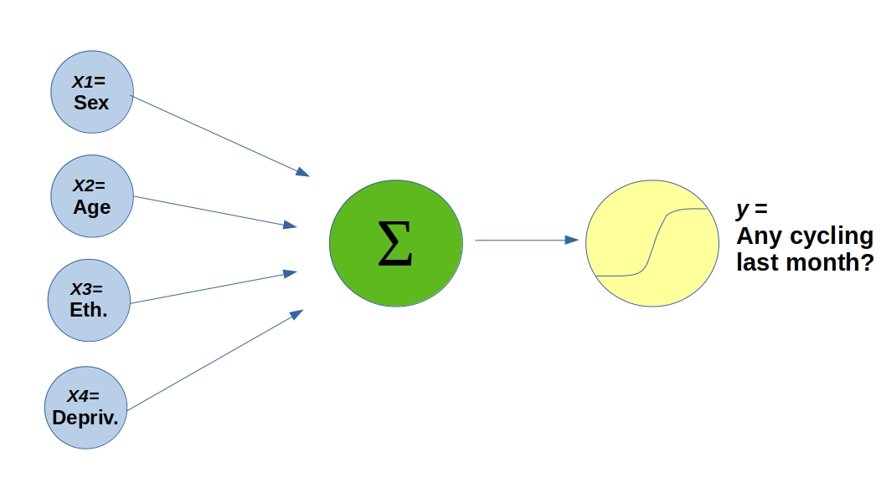
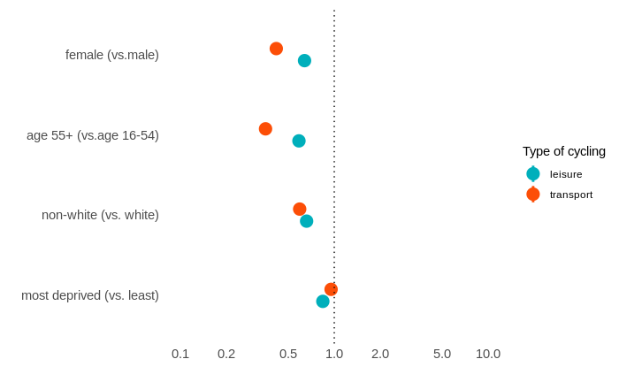

```{r setup, include=FALSE}
options(htmltools.dir.version = FALSE)
```

background-image: url('images/shutterstock_675381037-min.jpg')
background-position: center
background-size: cover
class: left, top

--

## Healthy


## Cheap


## Fast


##...

---

background-image: url('images/mamils_Source_Getty.jpg')
background-size: cover
--
background-image: url('images/mamils_Source_Getty_dark.jpg')
background-size: cover
class: inverse, center, middle

# What is the magnitude of cycling inequalities currently in England?

---

# Method

- **Data**: [Active Lives Survey 2015-2018](https://www.sportengland.org/research/active-lives-survey/) (sample of ~500,000 adults).

```{r echo=FALSE, out.width='20%'}

```

--

- **Statistical analysis**: Probability Ratios (PRs) using logistic regression.
```{r echo=FALSE, out.width='85%'}

```
---

background-image: url('images/RRs.jpg')
background-position: center
background-size: cover

# Results


```{r fig.wout.width='120%', include=FALSE}
#r::
```

```{r eval=FALSE, message=FALSE, warning=FALSE, include=FALSE, messaecho=FALSE, paged.print=FALSE}
library(ggplot2)
library(plotly)

rrs = readRDS(file = "all.rds")

#dodger = position_dodge(width = 0.3)

rrs <- rrs %>% 
  rename(group = activity, pr = or)

# Change order y
rrs$group <- ordered(rrs$group, levels = c("imd_2Most", "eth_2Non-white",  "age_255+", "gend_3Female"))

levels(rrs$group)

# Change na,es
levels(rrs$group) <-  c( "Most deprived (vs. least)", "Non-white (vs. white)",  "Age 55+ (vs.age 16-54)", "Female (vs.male)")
```

```{r eval=FALSE, include=FALSE}
# Elements like pointrange and position_dodge only work when the outcome
#   is mapped to y, need to go through with OR set as y then flip at the
#   end

p <- ggplot(rrs, aes( x = group, y = pr)) +
        geom_pointrange(color = "#F7005E", aes(ymin = low, ymax = hi),
                       size = 2) +
        geom_hline(yintercept = 1, linetype = "dotted", size = 1.5) +
        scale_y_log10(breaks = c(0.4, 0.6, 0.8, 1),
                      minor_breaks = NULL) +
        labs(y = "Probability Ratios (log scale)", x = "") +
        coord_flip(ylim = c(0.2, 1)) +
        theme_minimal() 

#p <- p + theme(panel.grid.major = element_blank(), panel.grid.minor = element_blank())

p <- p + theme(legend.title = element_blank())

#p <- p + scale_colour_manual(values = c("#00AFBB", "#FC4E07"))

#p <-  update_labels(p, list(colour="Type of cycling", size=12))

p <- p + theme(axis.text.x = element_text(  
                           size=20),
          axis.text.y = element_text( 
                           size=20),
        axis.title=element_text(size=18,face="bold"))
#p <- p + theme(legend.title = element_text(size = 12),
#          legend.text = element_text(size = 12))

#p <- ggplotly(p)

p

```

---

# Conclusion

- Substantial **inequalities in cycling participation in England** are found in relation to gender, age and ethnicity.

--

- **More research is needed** to identify the barriers that create these disparities.

---

background-image: url('images/04_Strasbourg_01-inline.jpg')
background-size: cover
--

background-image: url('images/04_Strasbourg_01-inline_dark.jpg')
background-size: cover
class: inverse, center, middle, 

# Thanks!
For more information visit https://eugenividal.github.io.

```{r include=FALSE}
#install.packages("webshot")
library(webshot)
```

```{r include=FALSE}
# install_phantomjs()
```

```{r include=FALSE}
# all_cycling <- paste0("file://", normalizePath("all_cycling.html"))
```

```{r include=FALSE}
# webshot(all_cycling, "all_cycling.pdf")
```
