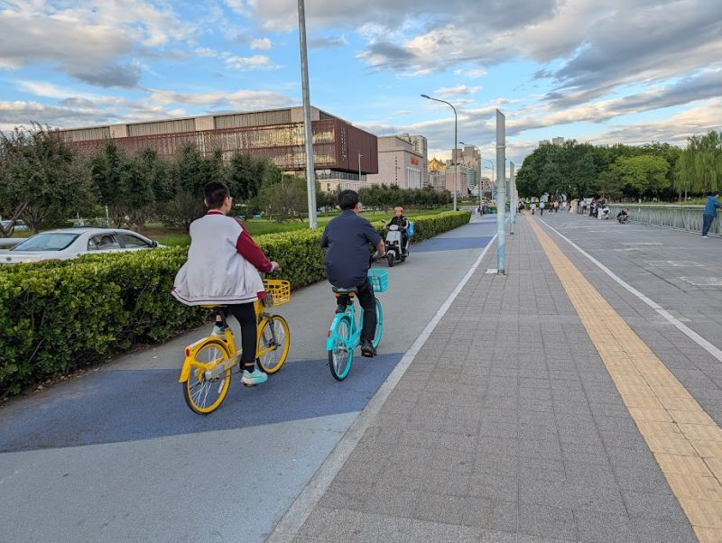
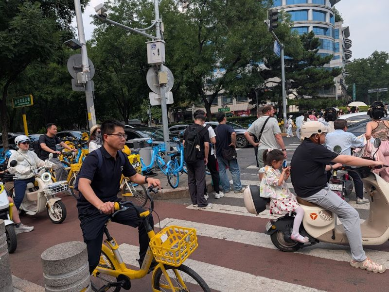
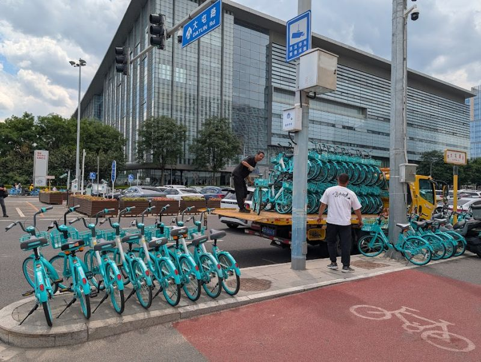
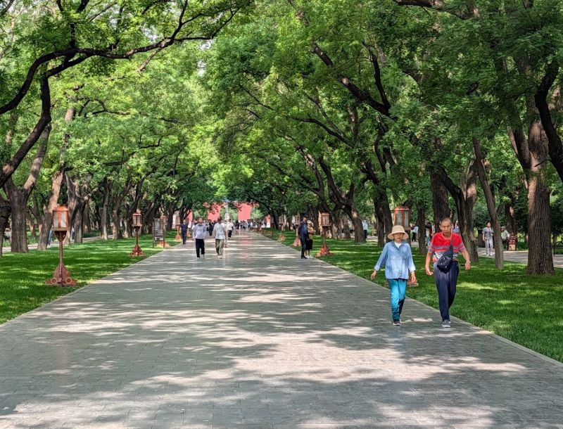

# News

Here I share news about my research, publications, conference presentations and ongoing projects.

---

## 8 June 2026

### Presented at WSTLUR 2026

Last week, I attended the 6th World Symposium on Transport and Land Use Research (WSTLUR 2026) in Beijing.

I presented our work "Can We Trust OpenStreetMap to Measure Cycling Infrastructure Change? A Reproducible Validation Framework Using Google Street View", developed with Oriol Marquet and Victor Gonzalez Parra as part of the ERC-funded ATRAPA (The Active Travel Backlash Paradox) project at GEMOTT, Universitat Autònoma de Barcelona.
Our findings suggest that OpenStreetMap can provide a reliable source for measuring cycling infrastructure change over time, although validation remains essential, particularly when studying infrastructure removals.

Slides available here: https://lnkd.in/gCgXjeJs

Beyond the conference, my first visit to Asia also provided an opportunity to observe Beijing's mobility system firsthand. I was particularly struck by the scale of cycling and micromobility use, the extensive infrastructure dedicated to these modes, the integration of services through platforms such as Alipay and WeChat, and the large presence of electric vehicles.

Overall, it was a fascinating opportunity to learn, exchange ideas, and gain new perspectives on the opportunities and challenges of sustainable urban mobility.

谢谢 (xièxie) to the organisers and volunteers for a wonderful conference!

#WSTLUR2026 #OpenStreetMap #CyclingInfrastructure #ActiveTravel #UrbanMobility #TransportResearch #SustainableTransport #GIS #Research

::: {.columns}

::: {.column width="50%" style="padding-right: 0.25rem;"}

{}

{}

:::

::: {.column width="50%" style="padding-left: 0.25rem;"}

{}

{}

:::

:::

---

## 22 May 2026

### 🚶‍♀️🚲 Walking or cycling to school may help reduce broader physical activity disparities among adolescents.

In our new open-access paper published in Health & Place, we examine how socioeconomic status and parental migration background relate to walking and cycling to school among Spanish youth.
We found that adolescents from more disadvantaged backgrounds were more likely to walk or cycle to and from school, particularly on the journey back home.

Much of these social differences appeared to be linked to environmental characteristics, especially home–school distance, which emerged as the strongest predictor of commuting behaviour.

🌍 These findings highlight the importance of proximity, walkable environments, and equitable urban planning in supporting active mobility where it is most needed.

📖 Open-access paper: https://lnkd.in/duCNtKxF

Co-authored with Pablo Campos Garzón, Ana Ruiz-Alarcón, Javier Molina-García, Jason Gilliland, and Palma Chillón Garzón.

#ActiveTravel #UrbanPlanning #PublicHealth #TransportEquity #AdolescentHealth